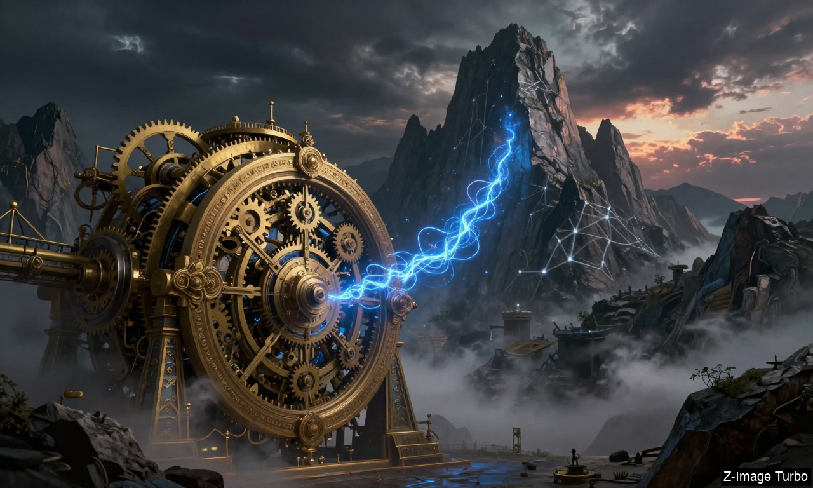
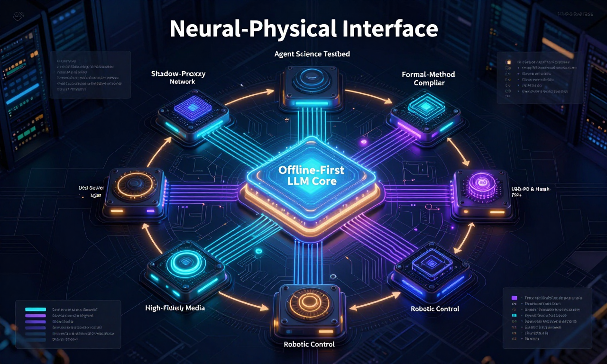
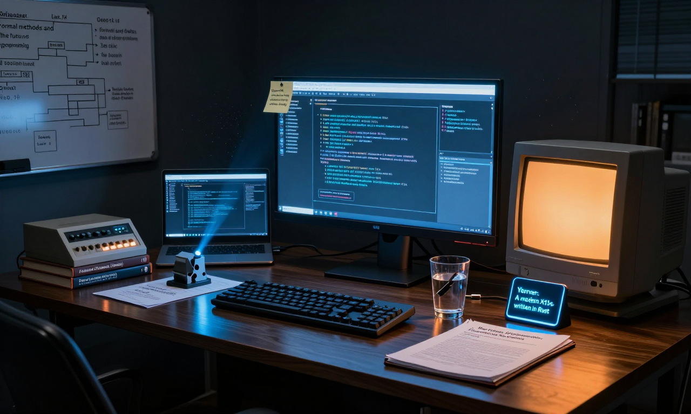
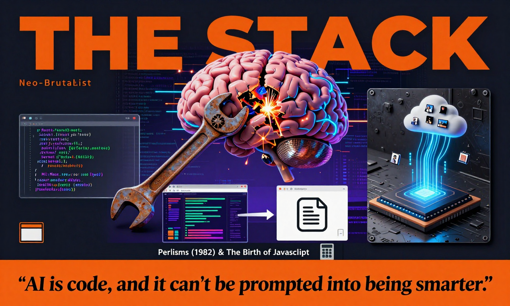
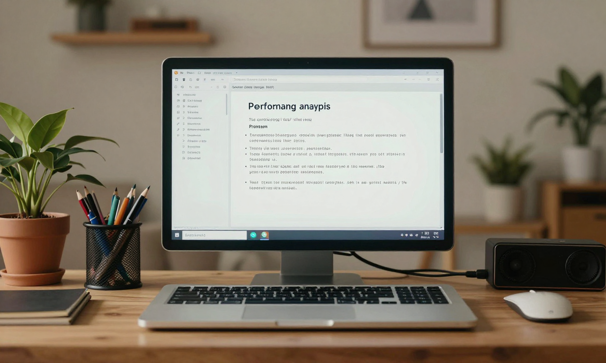

# HN Local Image

Generates a daily AI art piece based on the top stories currently on Hacker News, using 100% local Apple Silicon hardware. 

This is a local-first reimagining of the original concept, allowing you to generate "front page" artwork without relying on external cloud APIs (except for fetching the headlines themselves).

## Releases

See [RELEASE_NOTES.md](RELEASE_NOTES.md) for version history and detailed release information.

## Inspiration & Credits

This project was heavily inspired by and built upon the concepts of three fantastic projects:

1.  **[hn_dailyimage](https://github.com/LyalinDotCom/hn_dailyimage):** The original Go-based project that conceived the idea of turning Hacker News headlines into art using Gemini, including the clever post-processing for e-ink displays.
2.  **[MFlux](https://github.com/filipstrand/mflux):** A stellar line-by-line MLX port of generative image models. MFlux provides the high-performance local image generation engine that makes running this entirely on a Mac possible.
3.  **[mlx-vlm](https://github.com/Blaizzy/mlx-vlm):** Prince Canuma's MLX-based vision-language model package. mlx-vlm powers the local text model that analyzes the headlines and crafts the image prompts.

## Features

*   **100% Local Inference:** Uses MLX to run both the text model (for prompt analysis) and the image model (for generation) directly on your Mac.
*   **Multiple Image Models:** Supports `z-image-turbo` (default), FLUX.2 Klein, Ernie Image Turbo, and Ideogram 4 FP8. Ideogram 4 uses its native JSON-caption format and preset sampler for better quality.
*   **Multiple Styles:** Choose from various artistic directions (e.g., `editorial`, `story_scene`, `story_blueprint`, `story_desk`, `story_frontpage`, `original`).
*   **Target Profiles:** Output full-color, high-resolution PNGs for the `web`, or heavily processed, dithered 1-bit monochrome images optimized for `eink` displays.
*   **Terminal Preview:** Automatically previews the generated image directly in your terminal if you are using Kitty or Ghostty.

## Styles Gallery

All of the examples below are generated with `--target eink`: a 1-bit, dithered 800×480 monochrome image optimized for e-ink displays.

| Style | E-ink Example |
| :--- | :--- |
| **Editorial**<br>`--style editorial` |  |
| **Story Scene**<br>`--style story_scene` |  |
| **Story Blueprint**<br>`--style story_blueprint` |  |
| **Story Desk**<br>`--style story_desk` |  |
| **Story Frontpage**<br>`--style story_frontpage` |  |
| **Original**<br>`--style original` |  |

## Model Comparison

Different models interpret prompts in unique ways. Below are examples of how each available model visualizes the same Hacker News headlines (using the `--watermark` flag to identify models):

| Model | Example (with watermark) |
| :--- | :--- |
| **Z-Image Turbo** (fastest, ~9 steps) |  |
| **FLUX.2 Klein 4B** (balanced, ~4 steps) |  |
| **FLUX.2 Klein 9B** (higher quality, ~4 steps) |  |
| **Ernie Image Turbo** (fast, ~4 steps) |  |
| **Ideogram 4 FP8** (high quality, ~20 steps) |  |

Use the `--watermark` flag to add model identification when comparing outputs:
```bash
hn-local-image compare --watermark --style editorial
```

## High-Resolution Color Output

The default target is `web`, which produces full-color, high-resolution 1280×768 PNGs. The same six styles, generated with the default `z-image-turbo` model:

| Style | Color Example |
| :--- | :--- |
| **Editorial**<br>`--style editorial` |  |
| **Story Scene**<br>`--style story_scene` |  |
| **Story Blueprint**<br>`--style story_blueprint` |  |
| **Story Desk**<br>`--style story_desk` |  |
| **Story Frontpage**<br>`--style story_frontpage` |  |
| **Original**<br>`--style original` |  |

## Requirements

*   An Apple Silicon Mac (M1/M2/M3/M4)
*   Python 3.12+

## Installation

### Recommended: Install via PyPI with uv

[uv](https://github.com/astral-sh/uv) is the fastest Python package installer and highly recommended for running this tool.

**Run directly without installing:**
```bash
uvx hn-local-image
```

**Install for persistent use:**
```bash
uv tool install hn-local-image
hn-local-image
```

### Alternative: Install from source

Clone the repository and run the application using `uv`:

```bash
git clone https://github.com/ivanfioravanti/hn_local_image.git
cd hn_local_image
```

`uv run` will automatically manage the virtual environment and dependencies for you.

### Alternative: Install with pip

```bash
pip install hn-local-image
hn-local-image
```

### Optional: Install the Codex agent skill

This repository includes a Codex skill that teaches agents how to use the
published `hn-local-image` package. To make it available in Codex, copy it into
your skills directory:

```bash
mkdir -p "${CODEX_HOME:-$HOME/.codex}/skills"
cp -R skills/hn-local-image "${CODEX_HOME:-$HOME/.codex}/skills/"
```

For local skill development, symlink it instead so changes in this repo are
picked up immediately:

```bash
mkdir -p "${CODEX_HOME:-$HOME/.codex}/skills"
ln -sfn "$(pwd)/skills/hn-local-image" "${CODEX_HOME:-$HOME/.codex}/skills/hn-local-image"
```

After installing, ask Codex to use `$hn-local-image` for Hacker News headline
artwork, e-ink output, model comparisons, or headless upload automation.

## Usage

If installed via PyPI, run the command directly:

```bash
hn-local-image [OPTIONS]
```

If running from source, use `uv run`:

```bash
uv run main.py [OPTIONS]
```

### Examples

**Default (Editorial style, Web output, Z-Image Turbo):**
```bash
uv run main.py
```

**Generate an e-ink optimized image:**
```bash
uv run main.py --target eink
```

**Use a different style and the FLUX.2 Klein 9B image model:**
```bash
uv run main.py --style story_blueprint --image-model flux2-klein-9b
```

**Use a different local text model for prompt generation:**
```bash
uv run main.py --model-name "mlx-community/Llama-3.2-8B-Instruct-4bit"
```

### Options

*   `--style`: The artistic style to use (e.g., `editorial`, `story_scene`, `story_blueprint`, `story_desk`, `story_frontpage`, `original`). Default is `editorial`.
*   `--target`: The output processing mode (`web` or `eink`). Default is `web`.
*   `--image-model`: The image generation model to use (`z-image-turbo`, `flux2-klein-4b`, `flux2-klein-9b`, `ernie-image-turbo`, or `ideogram-4-fp8`). Default is `z-image-turbo`.
*   `--watermark`: Add a model name watermark to the bottom-right corner of the generated image for easy identification when comparing models.
*   `--model-name`: The Hugging Face repo ID of the MLX text model to use for prompt generation. Default is `mlx-community/gemma-4-e4b-it-8bit`.
*   `--output-dir`: Directory to save the generated images and JSON sidecars. Default is `generated/`.
*   `--headless`: Run without interaction.
*   `--headless-upload`: Automatically upload the generated image as a binary payload to a URL. Requires configuring the `WEBHOOK_URL` variable in a `.env` or `.env.example` file.

## Environment Variables

You can configure the application's default behavior without passing CLI flags by setting the following environment variables in a `.env` file in the project root:

```env
# Example .env.example file format:
WEBHOOK_URL=https://your-webhook-endpoint.com/upload

# Optional Overrides
PROMPT_MODE=editorial         # Equivalent to --style
TARGET_MODE=eink              # Equivalent to --target
OUTPUT_DIR=generated          # Equivalent to --output-dir
HN_URL=https://news.ycombinator.com/ # Override the default HN url
```

## Comparing Image Models

The `compare` command generates images with all available image models using the same prompt and seed, making it easy to compare quality and speed side by side.

**Compare a single style:**
```bash
uv run main.py compare --style editorial
```

**Compare a selected subset of image models:**
```bash
uv run main.py compare --style editorial --image-model z-image-turbo --image-model ideogram-4-fp8
```

**Compare all styles in one run (shared headlines and seed):**
```bash
uv run main.py compare --all-styles
```

**Compare with e-ink target:**
```bash
uv run main.py compare --all-styles --target eink
```

This produces a `generated/compare/<timestamp>/` directory with one subfolder per style, each containing:
- One `.png` per image model (`z-image-turbo.png`, `flux2-klein-4b.png`, `flux2-klein-9b.png`, `ernie-image-turbo.png`, `ideogram-4-fp8.png`)
- A `comparison.json` sidecar with prompt details, seed, and per-model timing
- A root `comparison.json` aggregating all styles (when using `--all-styles`)

## Webhooks / Headless Uploads

If you pass the `--headless-upload` flag, the application will automatically read the `WEBHOOK_URL` environment variable and perform an HTTP POST request sending the raw PNG bytes of the generated image (with `Content-Type: image/png`).

```bash
uv run main.py --target eink --headless-upload
```

This is heavily modeled after the original `hn_dailyimage` application to make pushing images to devices like e-ink displays seamless via Cron jobs.

## Output

The script will save two files in the output directory (default: `generated/`):

1.  The generated `.png` image.
2.  A `.json` sidecar file containing metadata about the generation, including the time, models used, headlines parsed, and the specific prompt used to generate the image.

## License

MIT License. See `LICENSE` for more details.
