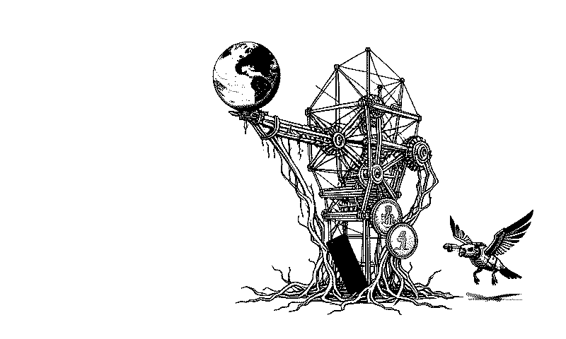
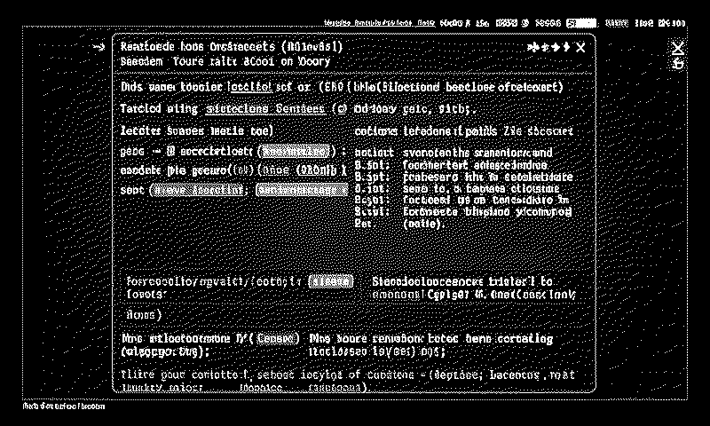
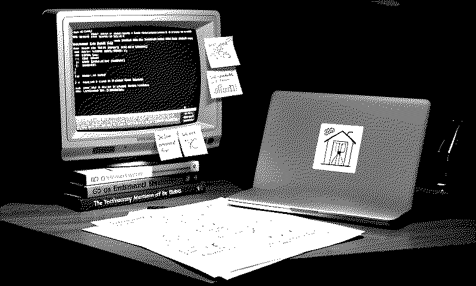
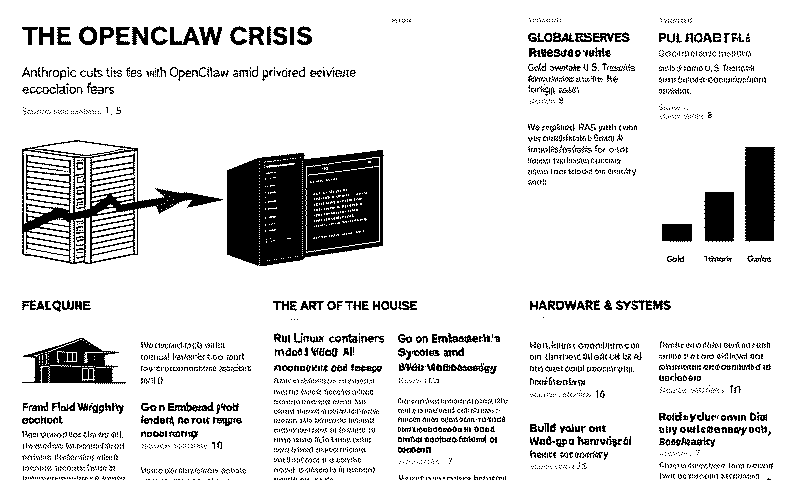
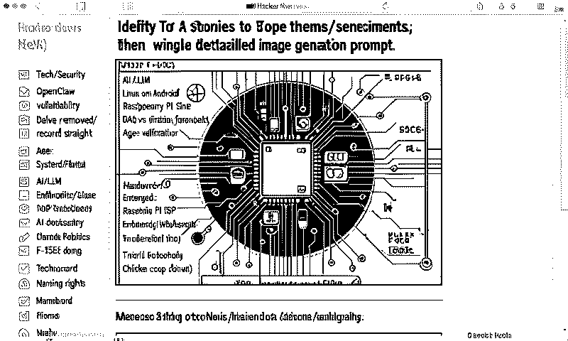

# HN Local Image

Generates a daily AI art piece based on the top stories currently on Hacker News, using 100% local Apple Silicon hardware. 

This is a local-first reimagining of the original concept, allowing you to generate "front page" artwork without relying on external cloud APIs (except for fetching the headlines themselves).

## Inspiration & Credits

This project was heavily inspired by and built upon the concepts of two fantastic projects:

1.  **[hn_dailyimage](https://github.com/LyalinDotCom/hn_dailyimage):** The original Go-based project that conceived the idea of turning Hacker News headlines into art using Gemini, including the clever post-processing for e-ink displays.
2.  **[MFlux](https://github.com/filipstrand/mflux):** A stellar line-by-line MLX port of generative image models. MFlux provides the high-performance local image generation engine that makes running this entirely on a Mac possible.

## Features

*   **100% Local Inference:** Uses MLX to run both the text model (for prompt analysis) and the image model (for generation) directly on your Mac.
*   **Multiple Image Models:** Supports fast models like `z-image-turbo` (default) and newer, highly capable FLUX.2 models like `flux2-klein-4b` and `flux2-klein-9b`.
*   **Multiple Styles:** Choose from various artistic directions (e.g., `editorial`, `story_scene`, `story_blueprint`, `story_desk`, `story_frontpage`, `original`).
*   **Target Profiles:** Output full-color, high-resolution PNGs for the `web`, or heavily processed, dithered 1-bit monochrome images optimized for `eink` displays.
*   **Terminal Preview:** Automatically previews the generated image directly in your terminal if you are using Kitty or Ghostty.

## Styles Gallery

The following examples demonstrate the different artistic styles available, generated using current Hacker News headlines.

| Style | Example |
| :--- | :--- |
| **Editorial**<br>`--style editorial` |  |
| **Story Scene**<br>`--style story_scene` |  |
| **Story Blueprint**<br>`--style story_blueprint` |  |
| **Story Desk**<br>`--style story_desk` |  |
| **Story Frontpage**<br>`--style story_frontpage` |  |
| **Original**<br>`--style original` |  |

## Requirements

*   An Apple Silicon Mac (M1/M2/M3/M4)
*   Python 3.12+
*   [`uv`](https://github.com/astral-sh/uv) (The fast Python package installer and resolver)

## Installation

Clone the repository and run the application using `uv`:

```bash
git clone https://github.com/yourusername/hn_local_image.git
cd hn_local_image
```

`uv run` will automatically manage the virtual environment and dependencies for you.

## Usage

Run the main CLI script:

```bash
uv run main.py [OPTIONS]
```

### Examples

**Default (Editorial style, Web output, Z-Image Turbo):**
```bash
uv run main.py
```

**Generate an e-ink optimized image:**
```bash
uv run main.py --target eink
```

**Use a different style and the FLUX.2 Klein 9B image model:**
```bash
uv run main.py --style story_blueprint --image-model flux2-klein-9b
```

**Use a different local text model for prompt generation:**
```bash
uv run main.py --model-name "mlx-community/Llama-3.2-8B-Instruct-4bit"
```

### Options

*   `--style`: The artistic style to use (e.g., `editorial`, `story_scene`, `story_blueprint`, `story_desk`, `story_frontpage`, `original`). Default is `editorial`.
*   `--target`: The output processing mode (`web` or `eink`). Default is `web`.
*   `--image-model`: The image generation model to use (`z-image-turbo`, `flux2-klein-4b`, or `flux2-klein-9b`). Default is `z-image-turbo`.
*   `--model-name`: The Hugging Face repo ID of the MLX text model to use for prompt generation. Default is `mlx-community/Qwen3.5-9B-MLX-8bit`.
*   `--output-dir`: Directory to save the generated images and JSON sidecars. Default is `generated/`.
*   `--headless`: Run without interaction.
*   `--headless-upload`: Automatically upload the generated image as a binary payload to a URL. Requires configuring the `WEBHOOK_URL` variable in a `.env` or `.env.example` file.

## Environment Variables

You can configure the application's default behavior without passing CLI flags by setting the following environment variables in a `.env` file in the project root:

```env
# Example .env.example file format:
WEBHOOK_URL=https://your-webhook-endpoint.com/upload

# Optional Overrides
PROMPT_MODE=editorial         # Equivalent to --style
TARGET_MODE=eink              # Equivalent to --target
OUTPUT_DIR=generated          # Equivalent to --output-dir
HN_URL=https://news.ycombinator.com/ # Override the default HN url
```

## Webhooks / Headless Uploads

If you pass the `--headless-upload` flag, the application will automatically read the `WEBHOOK_URL` environment variable and perform an HTTP POST request sending the raw PNG bytes of the generated image (with `Content-Type: image/png`).

```bash
uv run main.py --target eink --headless-upload
```

This is heavily modeled after the original `hn_dailyimage` application to make pushing images to devices like e-ink displays seamless via Cron jobs.

## Output

The script will save two files in the output directory (default: `generated/`):

1.  The generated `.png` image.
2.  A `.json` sidecar file containing metadata about the generation, including the time, models used, headlines parsed, and the specific prompt used to generate the image.

## License

MIT License. See `LICENSE` for more details.
